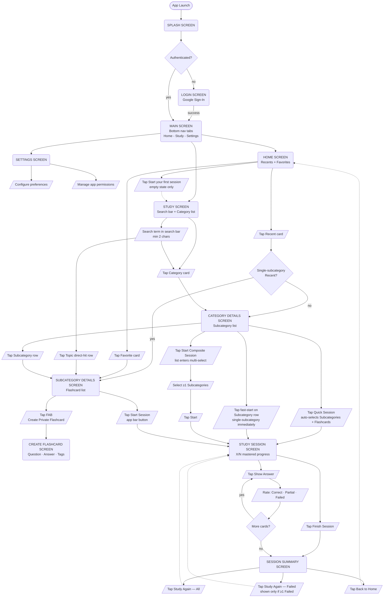

# User Flow

Screen-by-screen flow covering auth, all three main tabs, and session mechanics. Everything except the auth flow is planned per SYSTEMDESIGN.md.

```mermaid
flowchart TD

    %% Legend: (Screen)  [/User action/]  {Decision}  ([Terminal])

    %% ── Auth ────────────────────────────────────────────────
    Launch([App Launch]) --> Splash(SPLASH SCREEN)
    Splash --> AuthCheck{Authenticated?}
    AuthCheck -->|no| Login(LOGIN SCREEN\nGoogle Sign-In)
    Login -->|success| NavRoot
    AuthCheck -->|yes| NavRoot

    %% ── Navigation root ─────────────────────────────────────
    NavRoot(MAIN SCREEN\nBottom nav tabs\nHome - Study - Settings)
    NavRoot --> Settings
    NavRoot --> Home
    NavRoot --> Study

    %% ── Settings ─────────────────────────────────────────────
    Settings(SETTINGS SCREEN)
    Settings --> Prefs[/Configure preferences/]
    Settings --> Perms[/Manage app permissions/]

    %% ── Home ─────────────────────────────────────────────────
    Home(HOME SCREEN\nRecents + Favorites)
    Home --> TapCTA[/Tap Start your first session\nempty state only/]
    TapCTA -.-> Study
    Home --> TapRecent[/Tap Recent card/]
    Home --> TapFavorite[/Tap Favorite card/]
    TapRecent --> RecentType{Single-subcategory\nRecent?}
    RecentType -->|yes| SubcatDetails
    RecentType -->|no| CatDetails
    TapFavorite --> SubcatDetails

    %% ── Study ───────────────────────────────────────────────
    Study(STUDY SCREEN\nSearch bar + Category list)
    Study --> Search[/Search term in search bar\nmin 2 chars/]
    Study --> TapCategory[/Tap Category card/]
    Search --> TapSubcatRow[/Tap Topic direct-hit row/]
    Search --> TapCategory
    TapSubcatRow --> SubcatDetails
    TapCategory --> CatDetails

    %% ── Category Details ─────────────────────────────────────
    CatDetails(CATEGORY DETAILS SCREEN\nSubcategory list)
    CatDetails --> QuickSession[/Tap Quick Session\nauto-selects Subcategories + Flashcards/]
    CatDetails --> CompositeFlow[/Tap Start Composite Session\nlist enters multi-select/]
    CatDetails --> FastStart[/Tap fast-start on Subcategory row\nsingle-subcategory immediately/]
    CatDetails --> TapSubcat[/Tap Subcategory row/]
    CompositeFlow --> SelectSubcats[/Select ≥1 Subcategories/]
    SelectSubcats --> StartBtn[/Tap Start/]
    TapSubcat --> SubcatDetails

    %% ── Subcategory Details ─────────────────────────────────
    SubcatDetails(SUBCATEGORY DETAILS SCREEN\nFlashcard list)
    SubcatDetails --> StartSession[/Tap Start Session\napp bar button/]
    SubcatDetails --> CreatePrivate[/Tap FAB\nCreate Private Flashcard/]
    CreatePrivate --> CreateFlashcard(CREATE FLASHCARD SCREEN\nQuestion · Answer · Tags)

    %% ── Session entry ───────────────────────────────────────
    QuickSession --> Session
    FastStart --> Session
    StartBtn --> Session
    StartSession --> Session

    %% ── Study Session ───────────────────────────────────────
    Session(STUDY SESSION SCREEN\nX/N mastered progress)
    Session --> FinishEarly[/Tap Finish Session/]
    FinishEarly --> Summary
    Session --> Reveal[/Tap Show Answer/]
    Reveal --> Rate[/Rate: Correct · Partial · Failed/]
    Rate --> MoreCards{More cards?}
    MoreCards -->|yes| Reveal
    MoreCards -->|no| Summary

    %% ── Session Summary ──────────────────────────────────────
    Summary(SESSION SUMMARY SCREEN)
    Summary --> AgainAll[/Tap Study Again — All/]
    Summary --> AgainFailed[/Tap Study Again — Failed\nshown only if ≥1 Failed/]
    Summary --> BackHome[/Tap Back to Home/]
    AgainAll -.-> Session
    AgainFailed -.-> Session
    BackHome -.-> Home
```
