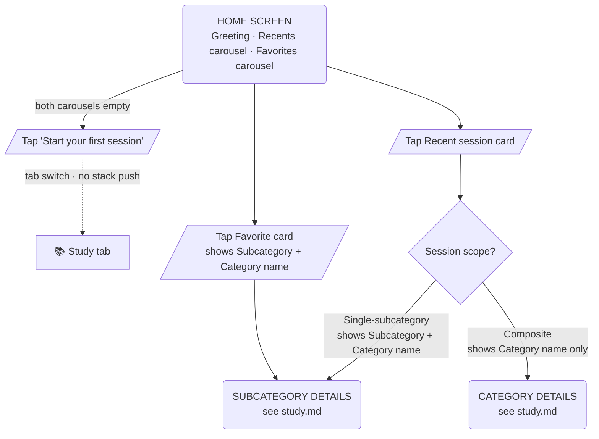

# User Flow — Home

Browsing recent sessions and bookmarked topics.

`CategoryDetails` and `SubcategoryDetails` are full-screen shared screens (no bottom nav). From the Home tab they use `HomeCategoryDetails` / `HomeSubcategoryDetails` route types (ADR-0003). Their internal flows are documented in [study.md](study.md).

