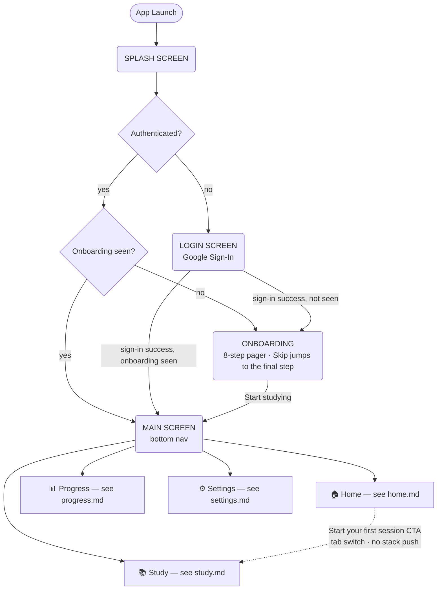

# User Flow — Main

Authentication entry/exit and the navigation shell. Each tab's internal flows are in their own file.

```mermaid
flowchart TD

    %% Legend: (Screen)  [/Action/]  {Decision}  ([Entry/Exit])  {{NYI}}

    %% ── App Launch ────────────────────────────────────────────────
    AppLaunch([App Launch]) --> Splash(SPLASH SCREEN)
    Splash --> AuthCheck{Authenticated?}
    AuthCheck -->|yes| SeenCheck{Onboarding seen?}
    AuthCheck -->|no| Login(LOGIN SCREEN\nGoogle Sign-In)
    SeenCheck -->|yes| NavRoot
    SeenCheck -->|no| Onboarding

    Login -->|sign-in success, onboarding seen| NavRoot
    Login -->|sign-in success, not seen| Onboarding(ONBOARDING\n8-step pager · Skip jumps to the final step)
    Onboarding -->|Start studying| NavRoot

    %% ── Navigation Root ───────────────────────────────────────────
    NavRoot(MAIN SCREEN\nbottom nav)
    NavRoot --> HomeTab[🏠 Home — see home.md]
    NavRoot --> StudyTab[📚 Study — see study.md]
    NavRoot --> ProgressTab[📊 Progress — see progress.md]
    NavRoot --> SettingsTab[⚙️ Settings — see settings.md]

    %% ── Cross-tab ─────────────────────────────────────────────────
    HomeTab -.->|"Start your first session" CTA\ntab switch · no stack push| StudyTab
```
