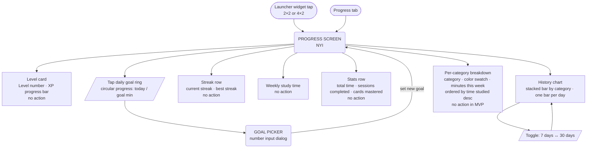

# User Flow — Progress

NYI — flows designed from ADRs and design docs. See [docs/design/progress-dashboard.md](../design/progress-dashboard.md), [docs/design/launcher-widget.md](../design/launcher-widget.md), [docs/design/session-stats-data-model.md](../design/session-stats-data-model.md).

## Entry points & screen

Widget tap on the device home screen opens the app and navigates directly to the Progress tab. If the app cold-starts, auth check runs first (see [main.md](main.md)).

## Widget sizes

| Size | Content |
|---|---|
| 2×2 small | Streak (flame + day count) · Daily goal ring (X / Y min) |
| 4×2 medium | Level number + XP progress bar · Streak · Today's goal · Weekly minutes |

Widget reads from DataStore only — no Firestore reads at widget update time. Updated after each session end. Shows placeholder state before first session.

## Data sources

| Stat | Source | When updated |
|---|---|---|
| Level, XP, streak, best streak | DataStore cache | Each session end |
| Today's minutes, weekly minutes | DataStore cache | Each session end |
| Total time, sessions completed, cards mastered | DataStore cache | Each session end |
| History chart (7/30 days) | Recomputed from Firestore | Progress screen load |
| Per-category breakdown | Recomputed from Firestore | Progress screen load |
