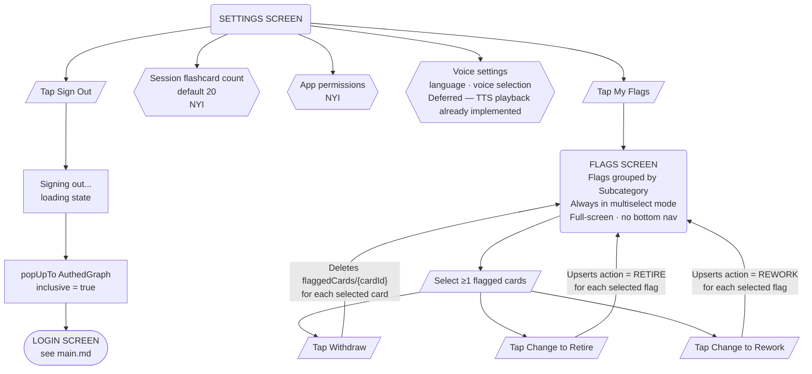

# User Flow — Settings

Settings preferences and flag management. Most settings items are NYI.

```mermaid
flowchart TD

    %% Legend: (Screen)  [/Action/]  {Decision}  ([Entry/Exit])  {{NYI}}

    Settings(SETTINGS SCREEN)

    %% ── Sign-out ──────────────────────────────────────────────────
    Settings --> TapSignOut[/Tap Sign Out/]
    TapSignOut --> SigningOut[Signing out...\nloading state]
    SigningOut --> ClearStack[popUpTo AuthedGraph\ninclusive = true]
    ClearStack --> Login([LOGIN SCREEN\nsee main.md])

    %% ── NYI settings items ────────────────────────────────────────
    Settings --> SessionCount{{Session flashcard count\ndefault 20\nNYI}}
    Settings --> Permissions{{App permissions\nNYI}}
    Settings --> VoiceSettings{{Voice settings\nlanguage · voice selection\nDeferred — TTS playback already implemented}}

    %% ── My Flags ──────────────────────────────────────────────────
    Settings --> TapMyFlags[/Tap My Flags/]
    TapMyFlags --> FlagsScreen

    FlagsScreen(FLAGS SCREEN\nFlags grouped by Subcategory\nAlways in multiselect mode\nFull-screen · no bottom nav)
    FlagsScreen --> SelectFlags[/Select ≥1 flagged cards/]
    SelectFlags --> TapWithdraw[/Tap Withdraw/]
    SelectFlags --> TapChangeRetire[/Tap Change to Retire/]
    SelectFlags --> TapChangeRework[/Tap Change to Rework/]

    TapWithdraw -->|"Deletes flaggedCards/{cardId}\nfor each selected card"| FlagsScreen
    TapChangeRetire -->|"Upserts action = RETIRE\nfor each selected flag"| FlagsScreen
    TapChangeRework -->|"Upserts action = REWORK\nfor each selected flag"| FlagsScreen
```
