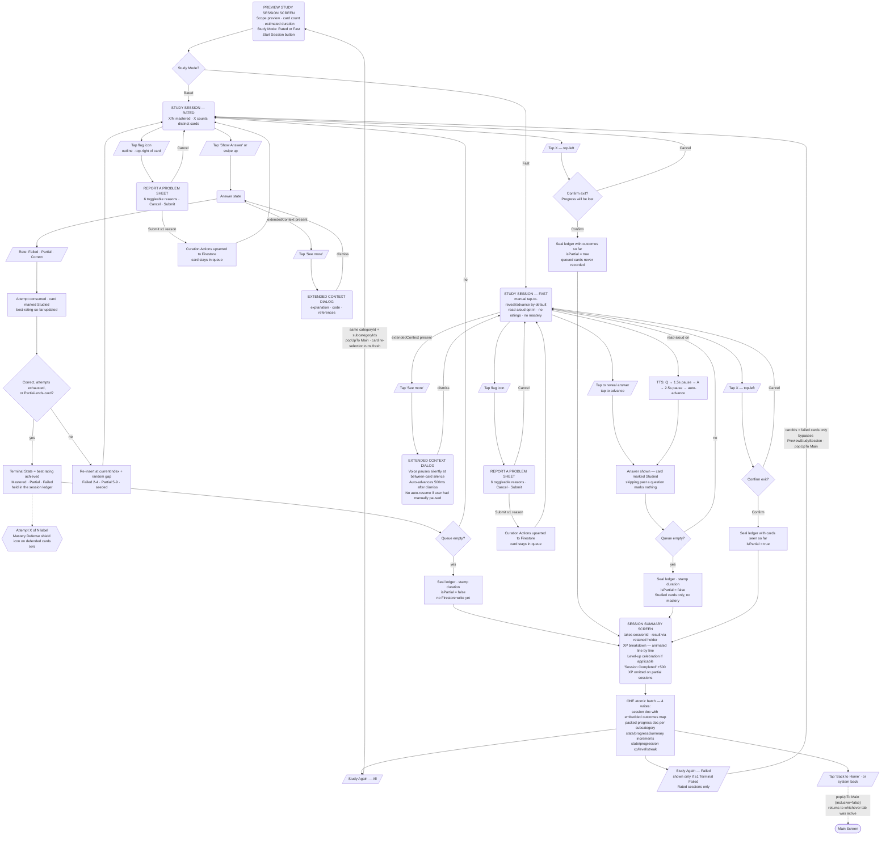

# User Flow — Study

Topic browsing, session entry, studying, and session summary. Launcher shortcut deep-links (pinned to device home screen) bypass the Study tab and enter directly at Category Details or Subcategory Details.

## Browse & entry

```mermaid
flowchart TD

    %% Legend: (Screen)  [/Action/]  {Decision}  ([Entry/Exit])

    StudyEntry([Study tab]) --> StudyScreen
    ShortcutEntry([Launcher shortcut\ndeep-link]) --> CatDetails
    ShortcutEntry --> SubcatDetails

    %% ── Study Screen ──────────────────────────────────────────────
    StudyScreen(STUDY SCREEN\nCategory list)
    StudyScreen --> TapCategory[/Tap Category card/]
    StudyScreen --> TypeSearch[/Search bar — min 2 chars/]

    TypeSearch --> Results(SEARCH RESULTS\nTopics section · Categories section)
    Results -->|no match| NoMatch(EMPTY STATE\nNo topics match ...)
    Results --> TapTopicRow[/Tap Topic row\nsingle-subcategory intent/]
    Results --> TapCatInResults[/Tap Category card/]
    TapTopicRow --> SubcatDetails
    TapCatInResults --> CatDetails
    TapCategory --> CatDetails

    %% ── Category Details ──────────────────────────────────────────
    CatDetails(CATEGORY DETAILS SCREEN\nSubcategory list)
    CatDetails --> TapSubcatRow[/Tap Subcategory row/]
    CatDetails --> TapFastStart[/Fast-start on row\nsingle subcat · skips Subcategory Details/]
    CatDetails --> TapQuickSession[/Quick Session\nauto-selects subcategories/]
    CatDetails --> TapCustom[/Start Custom Session\nlist → multi-select mode/]
    CatDetails --> CatAddShortcut[/⋮ → Add to home screen/]

    TapSubcatRow --> SubcatDetails
    TapFastStart --> PreviewStudySession(PREVIEW STUDY SESSION SCREEN)
    TapQuickSession --> PreviewStudySession
    CatAddShortcut --> ShortcutPinDialog[Android system\nshortcut pin dialog]

    TapCustom --> CatMultiselect(CATEGORY DETAILS\nmulti-select active)
    CatMultiselect --> SelectSubcats[/Select ≥1 subcategories/]
    SelectSubcats --> TapStartCustom[/Tap Start/]
    TapStartCustom --> PreviewStudySession

    %% ── Subcategory Details ───────────────────────────────────────
    SubcatDetails(SUBCATEGORY DETAILS SCREEN\nFlashcard list · collapsible items\nApp bar: back · bookmark · overflow)
    SubcatDetails --> TapFilterIcon[/Tap filter icon — bottom toolbar\nbadge dot when non-default/]
    SubcatDetails --> TapSortIcon[/Tap sort icon — bottom toolbar\nbadge dot when non-default/]
    SubcatDetails --> TapStartSession[/Tap Start Session — trailing FAB/]
    SubcatDetails --> TapFAB[/Add(+) icon — Create Private Flashcard/]
    SubcatDetails --> SubcatAddShortcut[/⋮ → Add to home screen/]

    SubcatAddShortcut --> ShortcutPinDialog

    TapFilterIcon --> FilterSheet(FILTER SHEET\nTags — Select All · Unselect All\nchips + Private chip · OR semantics\n+ Difficulty RangeSlider 1–10 · AND with tags\napplies on close · no Apply button)
    FilterSheet -->|dismiss| SubcatDetails

    TapSortIcon --> SortMenu(SORT MENU\nDefault · Easiest first · Hardest first\nreorders list only)
    SortMenu -->|select| SubcatDetails

    TapStartSession -->|filterTagIds = active tags| PreviewStudySession

    TapFAB --> CreateCard(CREATE PRIVATE FLASHCARD SCREEN\nQuestion · Answer · Tags)
    CreateCard -->|Save| SubcatDetails
```

## Session

> Study Mode selection happens on the Preview Study Session Screen; Fast mode is manual tap-to-reveal/advance by default, with read-aloud as an opt-in toggle (Voice row) that auto-starts voice playback (ADR-0004).
>
> Fast and Rated are **separate screens and routes** (ADR-0045) — the Preview screen picks one, and a session can never switch.
>
> **Mastery Defense (Rated only) — NYI:** design only (see [docs/design/persistent-card-mastery.md](../design/persistent-card-mastery.md)). Planned: mastered cards are never excluded from the pool, and at Preview Study Session card selection time a floor of 10% of the configured Length is topped up with mastered cards when a natural draw falls short. Every mastered card in the session is a defence card, shown with a small shield icon, no user interaction required. The session is always exactly its configured Length.
>
> **Nothing is written to Firestore during a session.** Both modes hand a result to the Session Summary screen, which computes XP and commits everything in one atomic batch (ADR-0014).


