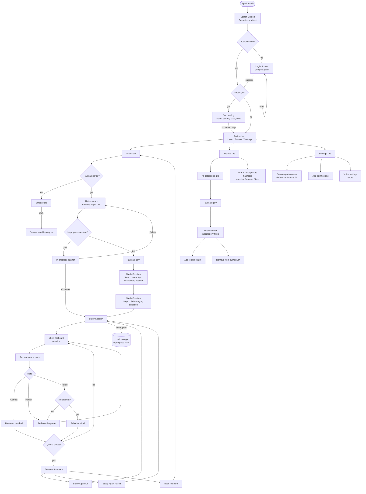

# User Journey

Complete user journey flowchart covering the auth flow, onboarding, all three main tabs,
study session mechanics, and browse/curriculum interactions.

Implemented screens are marked in the diagram comments. Everything else is planned per SYSTEMDESIGN.md.

