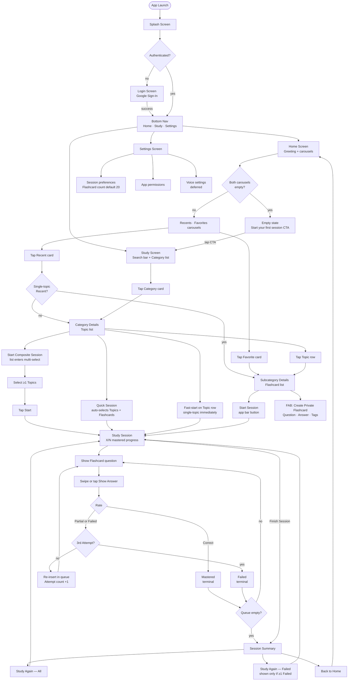

# User Journey

Complete user journey flowchart covering auth, all three main tabs, session mechanics, and
Subcategory Details. Everything except the auth flow is planned per SYSTEMDESIGN.md.

```mermaid
flowchart TD
    %% ── Auth (implemented) ────────────────────────────────
    Launch([App Launch]) --> Splash[Splash Screen]
    Splash --> AuthCheck{Authenticated?}
    AuthCheck -->|no| Login[Login Screen\nGoogle Sign-In]
    Login -->|success| NavRoot
    AuthCheck -->|yes| NavRoot

    %% ── Main navigation ───────────────────────────────────
    NavRoot[Bottom Nav\nHome · Study · Settings]
    NavRoot --> Home
    NavRoot --> Study
    NavRoot --> Settings

    %% ── Home screen ───────────────────────────────────────
    Home[Home Screen\nGreeting + carousels]
    Home --> BothEmpty{Both carousels\nempty?}
    BothEmpty -->|yes| EmptyHome[Empty state\nStart your first session CTA]
    EmptyHome -->|tap CTA| Study
    BothEmpty -->|no| Carousels[Recents · Favorites carousels]
    Carousels --> TapRecent[Tap Recent card]
    Carousels --> TapFavorite[Tap Favorite card]
    TapRecent --> RecentType{Single-topic\nRecent?}
    RecentType -->|yes| SubcatDetails
    RecentType -->|no| CatDetails
    TapFavorite --> SubcatDetails

    %% ── Study screen ──────────────────────────────────────
    Study[Study Screen\nSearch bar + Category list]
    Study --> TapCategory[Tap Category card]
    TapCategory --> CatDetails

    %% ── Category Details ──────────────────────────────────
    CatDetails[Category Details\nTopic list]
    CatDetails --> QuickSession[Quick Session\nauto-selects Topics + Flashcards]
    CatDetails --> CompositeFlow[Start Composite Session\nlist enters multi-select]
    CompositeFlow --> SelectTopics[Select ≥1 Topics]
    SelectTopics --> StartBtn[Tap Start]
    StartBtn --> Session
    QuickSession --> Session
    CatDetails --> FastStart[Fast-start on Topic row\nsingle-topic immediately]
    FastStart --> Session
    CatDetails --> TapTopic[Tap Topic row]
    TapTopic --> SubcatDetails

    %% ── Subcategory Details ───────────────────────────────
    SubcatDetails[Subcategory Details\nFlashcard list]
    SubcatDetails --> StartSession[Start Session\napp bar button]
    StartSession --> Session
    SubcatDetails --> CreatePrivate[FAB: Create Private Flashcard\nQuestion · Answer · Tags]

    %% ── Study Session ─────────────────────────────────────
    Session[Study Session\nX/N mastered progress]
    Session --> ShowQ[Show Flashcard question]
    ShowQ --> Reveal[Swipe or tap Show Answer]
    Reveal --> Rate{Rate}
    Rate -->|Correct| Mastered[Mastered\nterminal]
    Rate -->|Partial or Failed| AttemptCheck{3rd Attempt?}
    AttemptCheck -->|no| Reinsert[Re-insert in queue\nAttempt count +1]
    AttemptCheck -->|yes| FailedState[Failed\nterminal]
    Reinsert --> ShowQ
    Mastered --> QueueCheck{Queue empty?}
    FailedState --> QueueCheck
    QueueCheck -->|no| ShowQ
    QueueCheck -->|yes| Summary
    Session -->|Finish Session| Summary

    %% ── Session Summary ───────────────────────────────────
    Summary[Session Summary]
    Summary --> AgainAll[Study Again — All]
    Summary --> AgainFailed[Study Again — Failed\nshown only if ≥1 Failed]
    Summary --> BackHome[Back to Home]
    AgainAll --> Session
    AgainFailed --> Session
    BackHome --> Home

    %% ── Settings ──────────────────────────────────────────
    Settings[Settings Screen]
    Settings --> Prefs[Session preferences\nFlashcard count default 20]
    Settings --> Perms[App permissions]
    Settings --> Voice[Voice settings\ndeferred]
```
